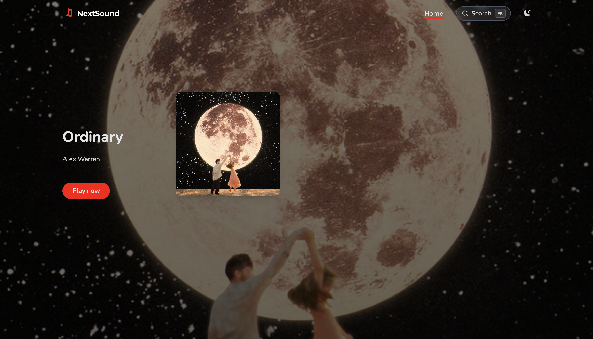
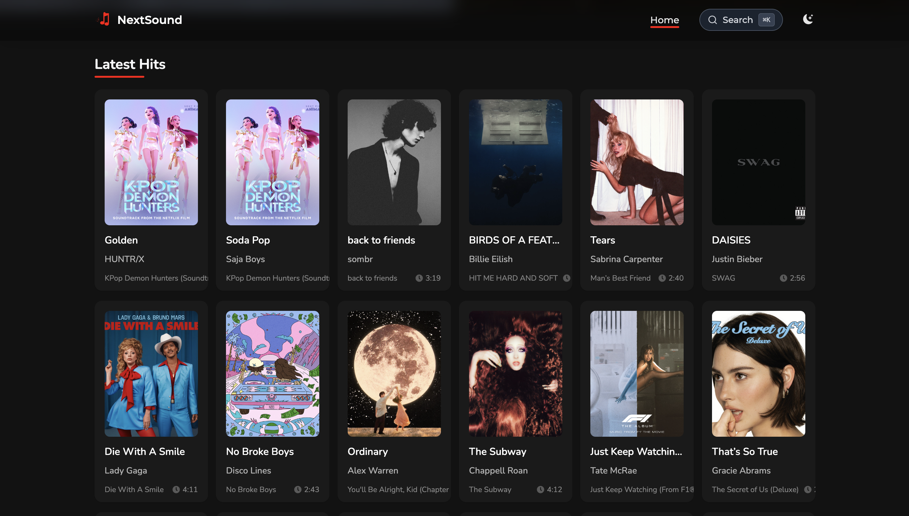

<div align="center">
  <br/>
  
  <h1>Savify</h1>
  <p>A Spotify-style music player built with React, TypeScript, and the Jamendo open music API.</p>
  <br/>

  
  
  
  

</div>

<br/>

## Features

- 🎵 **Real audio playback** — streams tracks directly from Jamendo's open music library
- 🔍 **Search** — search by title, artist, or genre with live results and a genre browse grid
- ❤️ **Liked Songs** — heart any track to save it; persists across sessions via localStorage
- 🕓 **Recently Played** — automatically tracks your listening history
- 📚 **Library page** — view your Liked Songs and Recently Played in one place
- ⏭️ **Queue & navigation** — next/back controls, auto-advance when a track ends
- 🔁 **Repeat modes** — off, repeat one, repeat all
- 🔊 **Volume control** — vertical slider with mute toggle; volume persists across refreshes
- 🌙 **Dark / light mode** — full theme support
- ⌘K **Command palette** — keyboard-driven search and navigation
- 📱 **Responsive** — works on mobile, tablet, and desktop

<br/>

## Screenshots

### Home — Hero & Latest Hits
<kbd></kbd>

<br/>

### Search — Genre Browse & Live Results
<kbd></kbd>

<br/>

## Getting started

You need **Node.js 18+** and **npm**.

### 1. Clone and install

```bash
git clone https://github.com/your-username/savify.git
cd savify
npm install
```

### 2. Add your Jamendo API key

Create a free account at [developer.jamendo.com](https://developer.jamendo.com) and register an app to get a **Client ID**. Then create a `.env` file in the project root:

```env
VITE_JAMENDO_CLIENT_ID=your_client_id_here
```

### 3. Run the app

```bash
npm run dev
```

Open [http://localhost:5173](http://localhost:5173).

> **No API key?** The app falls back to a curated set of demo tracks automatically — no setup needed to explore the UI.

<br/>

## Build for production

```bash
npm run build
npm run preview
```

<br/>

## Tech stack

| Layer | Technology |
|---|---|
| Framework | React 18 + TypeScript |
| Build tool | Vite 5 |
| Styling | Tailwind CSS |
| Routing | React Router v6 |
| Animations | Framer Motion |
| Audio | Web Audio API (HTMLAudioElement) |
| State | React Context API + custom hooks |
| Data layer | Redux Toolkit (store only) + custom fetch hooks |
| Music API | [Jamendo API v3](https://developer.jamendo.com/v3.0) |
| Icons | React Icons (Feather, Font Awesome) |
| Slider | Swiper.js |

<br/>

## Project structure

```
src/
├── components/ui/       # MiniPlayer, TrackCard, CommandPalette
├── common/              # Header, Footer, Sidebar, Section, MusicGrid, MusicSlides
├── context/             # audioPlayerContext (global player state)
├── hooks/               # useAudioPlayer (all playback logic)
├── pages/
│   ├── Home/            # Hero + section grid
│   ├── Search/          # Search input + genre browse + results
│   └── Library/         # Liked Songs + Recently Played tabs
├── services/
│   ├── MusicAPI.ts      # Jamendo fetch hooks (useGetTracksQuery etc.)
│   └── MCPAudioService.ts # Preview URL lookup + retry logic
└── utils/
    └── config.ts        # Jamendo API config (reads from .env)
```

<br/>

## How playback works

1. Clicking a track calls `playTrack(track)` from `useAudioPlayer`
2. If the track already has a `preview_url` (from Jamendo), it plays immediately
3. If not, `MCPAudioService` fetches a preview URL from Jamendo by track ID
4. The audio element is loaded and `.play()` is called
5. Progress, volume, and state are tracked in a single `AudioPlayerState` object
6. When a track ends, `handleEnded` reads the current queue from `stateRef` and auto-advances to the next track

<br/>

## Environment variables

| Variable | Required | Description |
|---|---|---|
| `VITE_JAMENDO_CLIENT_ID` | Yes (for live data) | Your Jamendo API client ID |

<br/>

---

<div align="center">
  <p>Built with ❤️ for music lovers · Powered by <a href="https://www.jamendo.com">Jamendo</a> open music</p>
</div>
